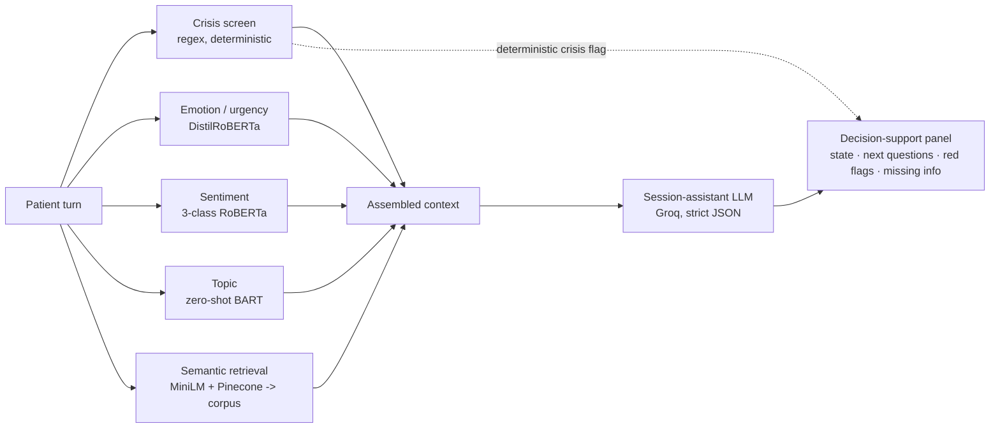

# 🩺 Live Session Assistant — Clinical Decision Support for Mental-Health Sessions

A real-time **co-pilot for mental-health clinicians**. The doctor enters a patient ID, the app loads the patient's history and clinical context, and during the live session it observes the doctor↔patient dialogue and surfaces concise, grounded decision support: the patient's likely emotional state, the next best questions to ask, follow-up points, and red flags or missing information to clarify.

> **Decision support — not a diagnosis.** The assistant supports clinical judgment; it never replaces it. Every suggestion is grounded in the patient's record and the live transcript, crisis detection is deterministic, and the clinician stays in control at all times.

---

## Table of contents
- [What it does](#what-it-does)
- [How it works](#how-it-works)
- [Architecture](#architecture)
- [Data model](#data-model)
- [Tech stack](#tech-stack)
- [Project structure](#project-structure)
- [Getting started](#getting-started)
- [Seeding synthetic data](#seeding-synthetic-data)
- [Usage](#usage)
- [Configuration](#configuration)
- [Testing](#testing)
- [Safety & responsible use](#safety--responsible-use)
- [Deployment](#deployment)
- [Roadmap & limitations](#roadmap--limitations)

---

## What it does

When a clinician opens a session for a patient, the app provides four things at a glance:

| The clinician needs to know… | The app provides |
|---|---|
| **Who the patient is** | A summary card: ID, clinical history, therapy goals, number of past sessions, last-seen date |
| **What happened before** | A session-history timeline (date · topics · risk flags · sentiment) and the most recent session's state |
| **What is happening now** | A two-channel live transcript plus per-turn analysis: emotional state, sentiment, topic, and a sentiment trajectory |
| **What to ask next & watch for** | An assistant panel: likely emotional state, **2–4 next questions to consider**, follow-up points, **missing information**, and **red flags** — each with a confidence indicator and a "why" (grounding) toggle |

Additional capabilities:

- **Two-channel transcript** — a speaker toggle logs both doctor and patient turns; only patient turns trigger analysis, and the doctor's questions inform "what to ask next" (so the assistant never repeats a question already asked).
- **Deterministic crisis detection** — a rule-based screen for suicide / self-harm / abuse runs first and independently of the LLM, surfacing the relevant protocol before anything else.
- **Grounded suggestions (RAG)** — every session uses semantic retrieval over a counseling Q&A corpus so advice is grounded in similar real cases, not generic output.
- **Explainability** — a "why this guidance" panel shows the driving signals, the retrieved cases, and the exact context sent to the model.
- **Doctor notes & audit trail** — a notes area for the clinician, plus a per-turn record of everything the assistant suggested.
- **Streaming progress** — a live status panel shows each pipeline stage (safety → emotion/topic/sentiment → retrieval → generation).
- **Demo mode** — seeded sample patients with one-click turns, so the tool can be explored end-to-end with no setup or database writes.
- **Optional authentication** — a shared-password gate (`APP_PASSWORD`) protects the app when configured.

---

## How it works

Each patient turn flows through a resilient pipeline. Cheap, deterministic signals (crisis screen) are computed first and never lost to a downstream failure; the heavier model/LLM steps degrade gracefully.



The session-assistant LLM is prompted to return **strict JSON** — `emotional_state`, `state_confidence`, `next_questions`, `follow_ups`, `missing_info`, `red_flags`, `caveat` — with rules baked in: ground every item in the transcript/record/retrieved cases, never diagnose or prescribe, phrase questions as "consider asking…", flag contradictions, and make uncertainty explicit. A robust parser tolerates code fences / surrounding prose and falls back to raw text if the model returns malformed JSON.

---

## Architecture

The codebase is organized into clear layers, with heavy models loaded once per process (`functools.lru_cache`) and a single pooled MongoDB client.

- **Entry points** — `app_chat.py` (Streamlit UI), `main_fastapi.py` (REST API), `main.py` (CLI).
- **Session intelligence** — `unified_guidance.py` (the analysis pipeline), `session_assistant.py` (structured decision support), `llm_rag.py` (Groq calls, blocking + streaming), `prompt_templates.py` (prompts).
- **Analysis models** — `topic_classifier.py`, `patient_ml.py` (sentiment), `urgency_detector.py` (emotion), `safety.py` (crisis), `semantic_search.py` (RAG), `model_cache.py` (cached embeddings / LLM / Pinecone index).
- **UI components** — `dashboard.py` (session metrics), `explain.py` (structured advice + "why" panel), `patient_overview.py` (summary card + history timeline).
- **Data layer** — `db.py` (Mongo client + collection names), `schemas.py` (Pydantic models), `patient_profile.py` (profiles + history retrieval), `archiver.py` (persistence), `config.py` (settings).

---

## Data model

### MongoDB — database `MentalHealthDB`

| Collection | Purpose | Keyed by |
|---|---|---|
| `corpus` | RAG knowledge base — counseling Q&A used for grounding | `questionID` |
| `PatientConvo` | Archived patient conversations (session transcripts) | `session_id` (+ `patient_id`) |
| `patients` | Patient profiles (clinical history, therapy goals) | `patient_id` |
| `sessions` | Per-session analytics & metadata (`SessionLog`) | `session_id` (+ `patient_id`) |

> The knowledge corpus and the conversation archive are kept in **separate collections** (`corpus` vs `PatientConvo`) so each has a single, clear purpose.

### Pinecone
A dense vector index (384-dim, cosine) holding embeddings of the `corpus` Q&A. Each vector's metadata carries the `questionID`, which resolves back to the full document in MongoDB during retrieval.

### Core schemas (`schemas.py`)
- **`Message`** — `content`, `is_user`, `speaker` (`doctor` | `patient`), `timestamp`, `metadata`.
- **`Conversation`** — `session_id`, `patient_id`, `messages`, timestamps.
- **`PatientProfile`** — `patient_id`, `medical_history`, `therapy_goals`.
- **`SessionLog`** — `session_id`, `patient_id`, `detected_topics`, `risk_flags`, `sentiment_score`, `doctor_notes`, `suggestions` (assistant audit), `created_at`.

---

## Tech stack

| Layer | Technology |
|---|---|
| UI | Streamlit (wide two-column "cockpit" layout, streaming, custom theme) |
| LLM | Groq — `llama-3.3-70b-versatile` via `langchain-groq` |
| Embeddings | `sentence-transformers/all-MiniLM-L6-v2` (local, 384-dim) |
| Topic | `facebook/bart-large-mnli` (zero-shot) |
| Sentiment | `cardiffnlp/twitter-roberta-base-sentiment-latest` (3-class, with a word-count fallback) |
| Emotion / urgency | `j-hartmann/emotion-english-distilroberta-base` |
| Vector DB | Pinecone |
| Database | MongoDB (Atlas or self-hosted) |
| Validation | Pydantic / pydantic-settings |
| API | FastAPI (optional REST entry point) |

All transformer pipelines run on CPU by default and are cached after first load, so only the first turn of a process pays the model-load cost.

---

## Project structure

```text
MentalHealth_Assistant/
├── app_chat.py              # Streamlit UI — the live session assistant (primary entry point)
├── main_fastapi.py          # FastAPI REST service (alternate entry point)
├── main.py                  # CLI for testing the guidance pipeline
│
├── unified_guidance.py      # analyze_message() pipeline + generate_counselor_guidance()
├── session_assistant.py     # generate_session_suggestions() (strict JSON) + parser + renderer
├── llm_rag.py               # Groq advice (blocking generate_advice + streaming stream_advice)
├── prompt_templates.py      # ADVICE_TEMPLATE + SESSION_ASSISTANT_TEMPLATE
│
├── topic_classifier.py      # Zero-shot topic classification (cached)
├── patient_ml.py            # 3-class sentiment (transformer + heuristic fallback)
├── urgency_detector.py      # Emotion / urgency detection (cached)
├── safety.py                # Deterministic crisis detection (suicide / self-harm / abuse)
├── semantic_search.py       # RAG: embed query -> Pinecone -> resolve against `corpus`
├── model_cache.py           # Cached embedding model, ChatGroq, Pinecone index
│
├── dashboard.py             # Session metrics (risk, sentiment trajectory, emotion, topics)
├── explain.py               # Structured advice rendering + "why this guidance" panel
├── patient_overview.py      # Patient summary card + session-history timeline
│
├── db.py                    # Pooled MongoDB client, get_db(), CORPUS_COLLECTION
├── schemas.py               # Pydantic models (Message, Conversation, PatientProfile, SessionLog)
├── patient_profile.py       # Profile CRUD + history retrieval (sessions / conversations)
├── archiver.py              # archive_conversation / archive_session / load_session
├── config.py                # Settings (.env via pydantic-settings) + safe Mongo URI handling
├── logging_config.py        # Centralized logging
│
├── seed_synthetic_data.py   # Guarded wipe + synthetic-data seeding tool (corpus + patients + sessions)
├── clustering.py            # (offline) Cluster corpus problems with KMeans
├── ml_model.py              # (offline) Predict upvotes from corpus text
├── data_loader.py           # (offline) Load corpus into LangChain Documents
│
├── tests/                   # pytest suite (no external services required)
├── requirements.txt         # Runtime dependencies
├── requirements-dev.txt     # Dev/test dependencies (pytest)
├── .streamlit/config.toml   # Streamlit theme + server config
└── .env                     # Secrets (not committed)
```

---

## Getting started

### Prerequisites
- Python 3.10+
- A MongoDB instance (local or MongoDB Atlas)
- A Pinecone account, API key, and an index (dimension **384**, metric **cosine**)
- A Groq API key (embeddings run locally, so no separate embedding-API key is needed)

### Installation

```bash
git clone https://github.com/SMK1705/MentalHealth_Assistant.git
cd MentalHealth_Assistant

python -m venv .venv
source .venv/bin/activate          # Windows: .venv\Scripts\activate

pip install -r requirements.txt
```

### Environment variables
Create a `.env` file in the project root:

```env
GROQ_API_KEY=your_groq_api_key
MONGO_URI=your_mongodb_uri            # mongodb:// or mongodb+srv:// (Atlas)
PINECONE_API_KEY=your_pinecone_api_key
PINECONE_INDEX_NAME=your_index_name
PINECONE_ENVIRONMENT=your_pinecone_region
APP_PASSWORD=optional_shared_password # if set, gates the app behind a login
```

> **Tip:** put the **raw** password in `MONGO_URI` (special characters and all) — the app URL-encodes credentials safely, and the encoding is idempotent, so already-encoded passwords are not double-encoded.

---

## Seeding synthetic data

`seed_synthetic_data.py` is a guarded utility that resets the databases and populates them with realistic synthetic data so every feature — grounding, the patient overview, and the history timeline — has data to work with.

```bash
# Dry run — shows current counts, changes nothing:
python seed_synthetic_data.py

# Destructive reset + reseed (requires the explicit flag):
KMP_DUPLICATE_LIB_OK=TRUE python seed_synthetic_data.py --confirm --patients 50
```

The `--confirm` flag is required — without it the script only reports current counts. A run wipes `patients`, `sessions`, `PatientConvo`, and `corpus` (plus the Pinecone namespace), then rebuilds:
- a synthetic mental-health Q&A **corpus** (MongoDB + Pinecone embeddings),
- **N patients** with clinical profiles,
- 2–4 **past sessions** per patient (topics, risk flags, sentiment, dates),
- one short archived **conversation** per session.

---

## Usage

### Run the app

```bash
streamlit run app_chat.py
```

Open `http://localhost:8501`.

1. **Open a session** — enter a patient ID (e.g. a seeded `PT-0001`) or click a **demo persona**. The overview card and session-history timeline load.
2. **Log the conversation** — use the **Patient / Doctor** speaker toggle and the input box to log each turn as it happens. Patient turns trigger the assistant.
3. **Read the assistant panel** — likely state, next questions, red flags, and missing info appear on the right, with confidence indicators and a "why this guidance" toggle.
4. **Add notes** — capture observations or overrides in the doctor-notes area (persisted with the session).
5. **End-of-session report** — generate a structured clinician-facing summary on demand.

### REST API (optional)

```bash
uvicorn main_fastapi:app --reload   # requires fastapi + uvicorn
```

`POST /guidance` with `{ "user_input", "patient_profile", "conversation_history" }` returns the analysis + generated guidance.

### CLI (optional)

```bash
python main.py
```

---

## Configuration

| Variable | Required | Description |
|---|---|---|
| `GROQ_API_KEY` | ✅ | Groq API key for LLM inference |
| `MONGO_URI` | ✅ | MongoDB connection string (`mongodb://` or `mongodb+srv://`) |
| `PINECONE_API_KEY` | ✅ | Pinecone API key |
| `PINECONE_INDEX_NAME` | ✅ | Name of the Pinecone index (384-dim, cosine) |
| `PINECONE_ENVIRONMENT` | ✅ | Pinecone region/environment |
| `APP_PASSWORD` | ⬜ | If set, the app requires this shared password before use |

**Authentication:** when `APP_PASSWORD` is set, the app shows a login prompt and requires the password once per session. When unset, the app runs without authentication (a warning is logged at startup) — suitable for local development and demos.

---

## Testing

The unit suite runs without any external services (no MongoDB, Pinecone, or model downloads) — `conftest.py` provides dummy settings, and modules that need heavy libraries import them lazily.

```bash
pip install -r requirements-dev.txt
pytest
```

Coverage includes deterministic crisis detection (`safety`), sentiment behavior + fallback (`patient_ml`), Mongo URI encoding (`config`), advice parsing (`explain`), and the session-assistant JSON parser + summary builders (`session_assistant`).

---

## Safety & responsible use

This is a **clinical decision-support prototype**, not a certified medical device, and it must be used under clinician supervision.

- **Decision support, not diagnosis.** The assistant suggests; it never decides. Questions are framed as "consider asking…", and a disclaimer is shown at all times.
- **Deterministic crisis handling.** Suicide / self-harm / abuse screening is rule-based and runs independently of the LLM, so a crisis indicator is surfaced even if the language model fails. It is an *assist*, not a guarantee — clinician judgment remains essential.
- **Grounded, not generic.** Suggestions are grounded in the patient's record, the live transcript, and retrieved similar cases.
- **Uncertainty is explicit.** Confidence indicators accompany suggestions; low-confidence items are flagged as hints to consider.
- **Privacy.** Use de-identified data. Secrets live in `.env` (never committed); manage them via a secrets service in production.

---

## Deployment

- **Streamlit Community Cloud** — point the app at `app_chat.py` and configure the environment variables in the app's secrets.
- **Docker** — a `Dockerfile` is provided for containerized deployment (Render, Fly.io, etc.).
- **Production notes** — set `APP_PASSWORD`, manage secrets via a dedicated service, and ensure the Pinecone index dimension matches the embedding model (384).

---

## Roadmap & limitations

- **Scope:** currently mental-health / psychiatry — the topic, emotion, and crisis models and the Q&A corpus are domain-specific. A general-medicine variant would require different models and a different knowledge base.
- **Compute:** transformer inference runs on CPU; first-turn latency is dominated by model loading. A GPU or lighter models would reduce per-turn latency.
- **Planned:** cross-session contradiction detection, an LLM-synthesized longitudinal patient summary, richer audit/export, and per-clinician accounts/roles.

---

*Built with Streamlit, Groq, Pinecone, MongoDB, and the Hugging Face transformers ecosystem.*
